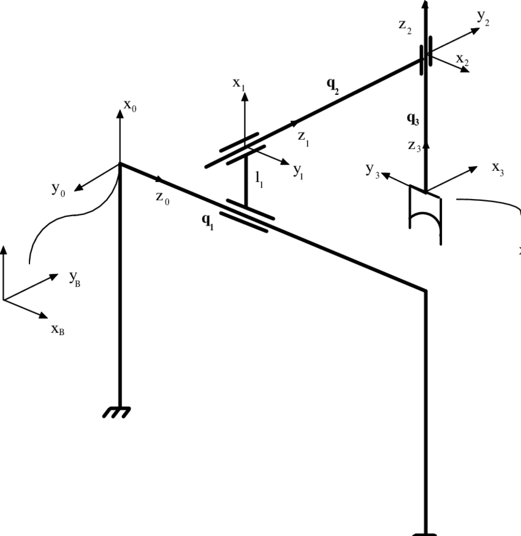
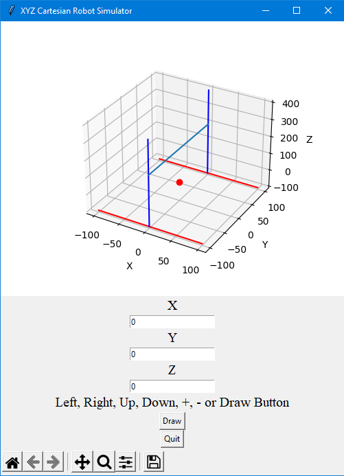
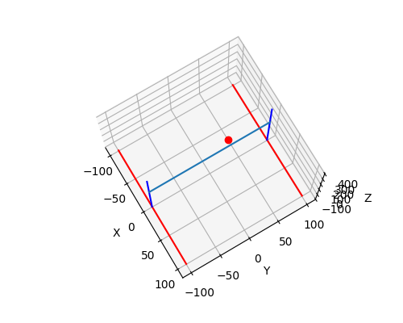
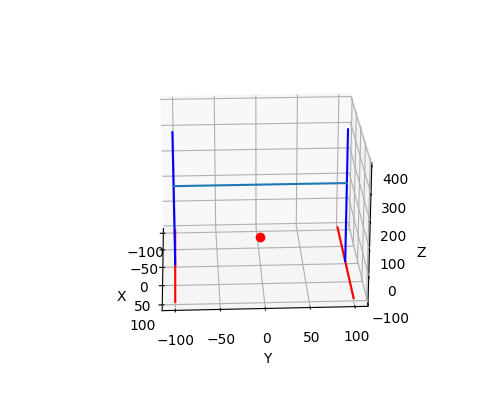
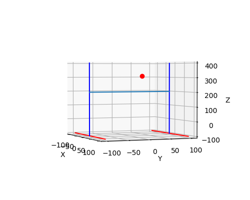
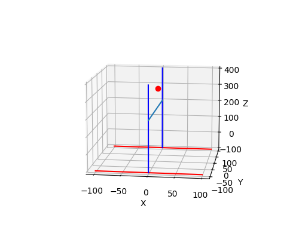

# xyz-cartesian-robot-simulator
XYZ Cartesian Robot Simulator

This is a very simple XYZ simulator. Python 3.9 and matplotlib were used.
Codes were also developed very simply with Tkinter.

This code shows the coordinates taken from the keyboard or the xyz input tool in the Cartesian system.

Press the left and right keys on the keyboard to orient the Z axis left and right.
Press the up and down keys on the keyboard to direct the Y axis forward and backward.
Press the + and - keys on the keyboard to move the Z axis up and down.

You can do detailed research to get information about kinematics.

When the code is run, a window will open. You can see the robot's position has changed in this window.

Other images

